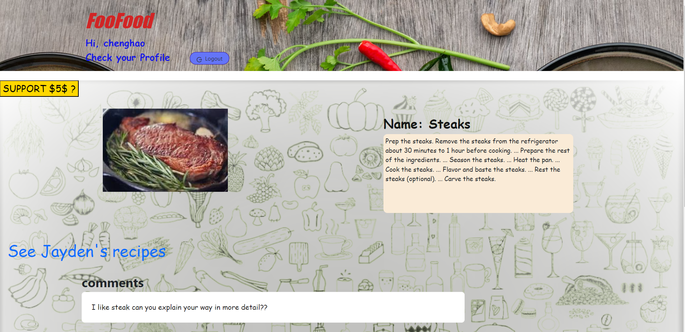

  
# FooFood

## Description
At Foofood, food brings people together. This platform is designed to foster a vibrant community of food enthusiasts, home cooks, and passionate individuals who love sharing their culinary creations with the world.

## Installation
 npm install

## Technologies
	MERN,
	Cloudinary,
	Antd,
	Bootstrap,
	Graphql,
	JWT,
	Stripe,

## Features
    login/signup,
    Check other user recipes,
    Create recipe with name, description and upload image
    Commenting other user's recipe ()
    Update your recipe's description 
    Delete your recipe
    Donation
    
## Screenshots

 ## Contributing
    Chenghao

## Questions
    If there is any other questions please contact
    Chenghao : houchenghao@hotmail.com

## Github
    https://github.com/houchenghao/FooFood

## Deploy
    https://foo-food.herokuapp.com/